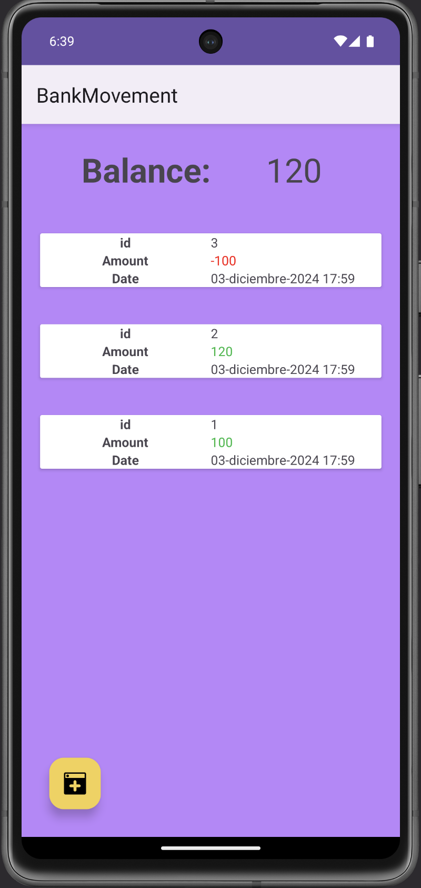
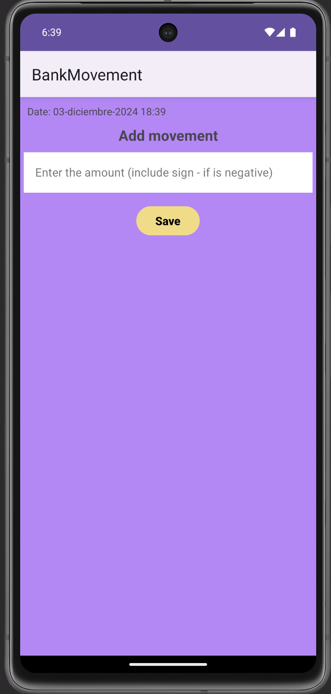

# BankMovement

Proyecto: App de Movimientos Bancarios.

Permite registrar movimientos de ingresos e ingresos y almacena cada movimiento con un id, monto y fecha del movimiento en una base de datos SQLite en local, y muestra un balance general de los movimientos almacenados.
## Imágenes

## Requerimientos:

 - Crear una aplicación que tenga dos Activities:  Main⭐ Add Movement⭐
 - Crear una tabla "Movimientos" en base de datos SQLite:  ID⭐ Cantidad⭐ Fecha⭐
 - Implementar una RecyclerView para mostrar la lista de movimientos: Listo en el Main⭐
 - Utiliza un Adapter personalizado para mostrar la fecha del movimiento, la cantidad y un icono o texto en color rojo o verde según si es un ingreso o gasto: Listo en el Main⭐
 - Añade un TextView donde se muestre el balance de la cuenta (ingresos + gastos): Listo en el Main⭐
- Añade un botón o menú que permita abrir el Activity de añadir movimiento: Botón añadido en el Main⭐
- En el Activity de añadir movimiento, debe haber un formulario donde rellenaremos la cantidad y la fecha del movimiento, y un botón para insertarlo en base de datos: Listo ⭐
- Asegúrate de que al guardar un movimiento y volver a la lista de movimientos, el nuevo movimiento quede reflejado en la lista: Listo ⭐

## Tech Stack

**Utilizando:** Android Studio, Kotlin.

## License

[MIT](https://choosealicense.com/licenses/mit/)